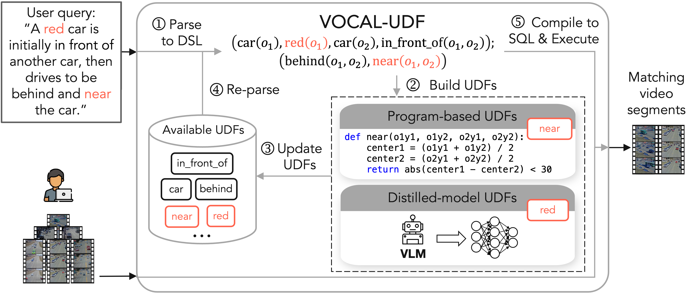

# VOCAL-UDF

<p align="center">
    
<p>

A prototype implementation of VOCAL-UDF, which is a self-enhancing video data management system that empowers users to flexibly issue and answer compositional queries, even when the modules necessary to answer those queries are unavailable. See the [technical report](https://arxiv.org/pdf/2408.02243) for more details.

## Setup Instructions

The project uses `conda` to manage dependencies. To install conda, follow the instructions [here](https://docs.conda.io/projects/conda/en/latest/user-guide/install/).

```sh
# Clone the repository
git clone https://github.com/uwdb/VOCAL-UDF.git
cd VOCAL-UDF

# Create a conda environment (called vocal-udf) and install dependencies
conda env create -f environment.yml --name vocal-udf
conda activate vocal-udf
python -m pip install -e .
```

To use OpenAI models, follow the instructions [here](https://platform.openai.com/docs/quickstart#create-and-export-an-api-key) to create and export an API key.
```sh
# Export the API key as an environment variable
export OPENAI_API_KEY="your_api_key_here"
```

## Prepare Data

### CLEVRER
1. Download the CLEVRER dataset from [here](http://data.csail.mit.edu/clevrer/videos/train/video_train.zip). Place the videos in `data/clevrer/`.
2. Extract the frames from the videos using the following command. This will create a `video_frames` directory in `data/clevrer/`.
```sh
cd data/clevrer
python extract_frames.py
```
3. Prepare the database. Download the processed annotations from [here](https://drive.google.com/drive/folders/1FBmPlQ1haRCxsmgYMSqaZVPdCp6fcI1m?usp=drive_link) and place them in `duckdb_dir/`.
4. Create relations and load data into the database.
```sh
cd duckdb_dir
python load_clevrer.py
```
5. Extract the features from the frames using the following command. This will create a `features/clevrer_three_clips` directory in `duckdb_dir`.
```sh
cd featurestore
# Extract attribute features (about 16GB)
python extract_clevrer.py --method "attribute"
# Extract relationship features (about 113GB)
python extract_clevrer.py --method "relationship"
```

### CityFlow-NL
1. Obtain the CityFlow-NL dataset from [here](https://docs.google.com/forms/d/e/1FAIpQLSdOVC33d-R23PCuBdSsmo08e-98HiDLykhIIAzryjzjYoilVQ/viewform) (i.e., [2023 Track 2](https://www.aicitychallenge.org/2023-track2-download/); For more information, see [here](https://www.aicitychallenge.org/)). Place the videos in `data/cityflow/`. Next, run `python extract_vdo_frms.py` to extract the frames from the videos. The file structure should look like this:
```
data/cityflow/data/
├── extract_vdo_frms.py
├── test-queries.json
├── train-tracks.json
├── test-tracks.json
├── train/
│   ├── S01/
│   │   ├── c001/
│   │   │   ├── calibration.txt
│   │   │   ├── det/
│   │   │   ├── gt/
│   │   │   ├── img1/
│   │   │   ├── mtsc/
│   │   │   ├── roi.jpg
│   │   │   ├── segm/
│   │   │   └── vdo.avi
│   │   ├── c002/...
│   │   ├── ...
│   ├── S03/...
│   ├── S04/...
└── validation/...
```
2. Prepare the database. Download the processed annotations from [here](https://drive.google.com/drive/folders/1FBmPlQ1haRCxsmgYMSqaZVPdCp6fcI1m?usp=drive_link) and place them in `duckdb_dir/`.
3. Create relations and load data into the database.
```sh
cd duckdb_dir
python load_cityflow.py
```
4. Extract the features from the frames using the following command. This will create a `features/cityflow_three_clips` directory in `duckdb_dir`.
```sh
cd featurestore
# Extract attribute features
python extract_cityflow.py --method "attribute"
# Extract relationship features
python extract_cityflow.py --method "relationship"
```

### Charades
1. Download the Charades dataset (scaled to 480p) from [here](https://prior.allenai.org/projects/charades). Place the videos in `data/charades/`.
2. Download Action Genome annotations from [here](https://drive.google.com/drive/folders/1LGGPK_QgGbh9gH9SDFv_9LIhBliZbZys?usp=sharing). Place the annotations in `data/charades/`.
3. Extract the frames from the videos using the following command. This will create a `frames` directory in `data/charades/`.
```sh
cd data/charades
python dump_frames.py
```
4. Prepare the database. Download the processed annotations from [here](https://drive.google.com/drive/folders/1FBmPlQ1haRCxsmgYMSqaZVPdCp6fcI1m?usp=drive_link) and place them in `duckdb_dir/`.
5. Create relations and load data into the database.
```sh
cd duckdb_dir
python load_charades.py
```
6. Extract the features from the frames using the following command. This will create a `features/charades_five_clips` directory in `duckdb_dir`.
```sh
cd featurestore
# Extract relationship features (about 15GB; takes around 2 hours). Charades has no attribute features
python extract_cityflow.py --include_text_features
```

## Example Usage
We provide an example of how to use VOCAL-UDF to process a query with three missing UDFs on the CLEVRER dataset.
1. Generate UDFs
```bash
python experiments/async_main.py \
    --num_missing_udfs 3 \
    --run_id 0 \
    --query_id 0 \
    --dataset "clevrer" \
    --query_filename "3_new_udfs_labels" \
    --budget 20 \
    --n_selection_samples 500 \
    --num_interpretations 10 \
    --allow_kwargs_in_udf \
    --program_with_pixels \
    --num_parameter_search 5 \
    --num_workers 8 \
    --save_labeled_data \
    --n_train_distill 100 \
    --selection_strategy "both" \
    --llm_method "gpt" \
    --is_async \
    --openai_model_name "gpt-4o"
```

2. Execute query with new UDFs
```bash
python experiments/run_query_executor.py \
    --num_missing_udfs 3 \
    --run_id 0 \
    --query_id 0 \
    --dataset "clevrer" \
    --query_filename "3_new_udfs_labels" \
    --budget 20 \
    --n_selection_samples 500 \
    --num_interpretations 10 \
    --allow_kwargs_in_udf \
    --program_with_pixels \
    --num_parameter_search 5 \
    --num_workers 8 \
    --n_train_distill 100 \
    --selection_strategy "both" \
    --pred_batch_size 4096 \
    --dali_batch_size 1 \
    --llm_method "gpt"
```

## Reproduce Experiments
The experiment scripts are located in the `scripts/experiments` directory.

## Working with Your Own Queries
We provide a Command-Line Interface (CLI) to process your own queries over the CLEVRER, CityFlow-NL, and Charades datasets.

1. Run the following command to specify the dataset and hyperparameters:
```bash
python experiments/cli.py \
    --dataset cityflow \
    --allow_kwargs_in_udf \
    --num_parameter_search 5 \
    --budget 20 \
    --n_selection_samples 500 \
    --num_interpretations 10 \
    --num_workers 8 \
    --n_train_distill 500 \
    --selection_strategy both \
    --llm_method gpt \
    --is_async \
    --openai_model_name gpt-4o
```

2. In the terminal, you will be prompted to enter your query in natural language and then a list of UDFs that are available to answer the query. Some good examples to start with:

| Dataset     | Query  | List of UDFs (indices) |
| -------- | ------- | ----------------------- |
| CLEVRER  |  A cyan-colored object o1 is in front of a cylinder o2, then o1 moves to be behind and close to o2.  | 1, 14,19 |
| CityFlow-NL | A red car is initially in front of another car, then drives to be behind and near the car     | 2, 9 |

3. Then, VOCAL-UDF will start to process the query and generate the missing UDFs when needed. You will see the progress in the terminal. During the UDF selection stage, you will be prompted to provide labels for system-selected frames.

4. Once the query is processed, VOCAL-UDF will output all matching vids in the terminal. For CityFlow-NL and Charades datasets, to map the vid to the corresponding video file, please refer to the `duckdb_dir/{dataset}_metadata.csv` file.

## Working with Your Own Data
TODO